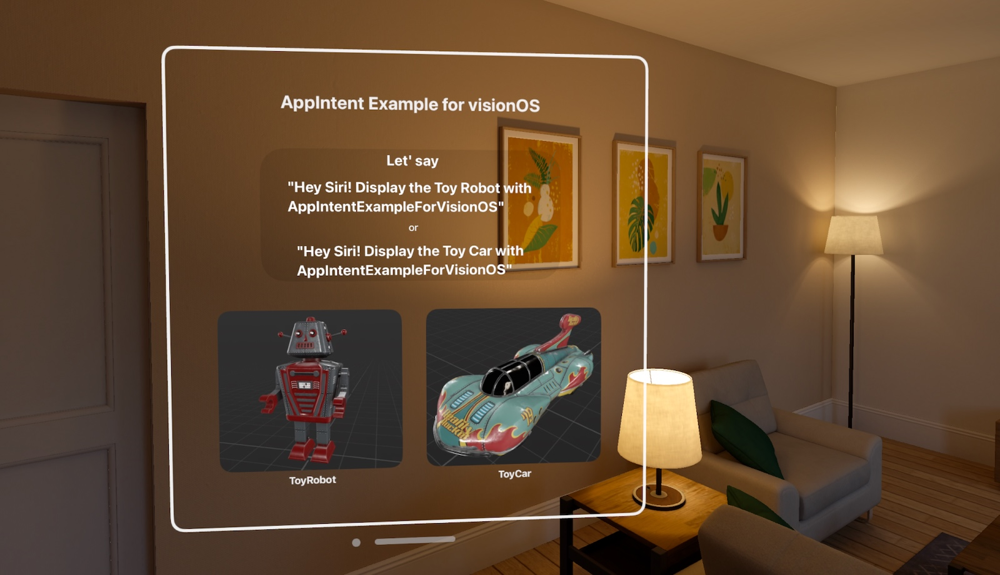
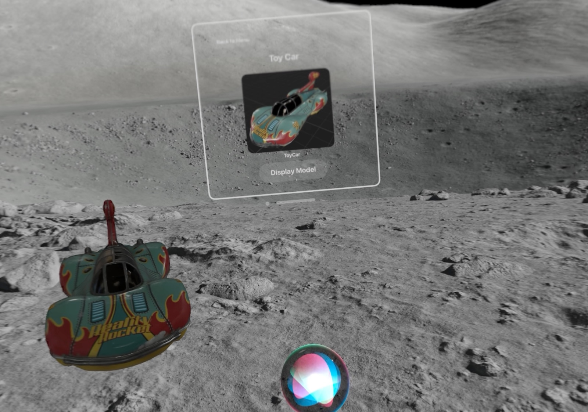
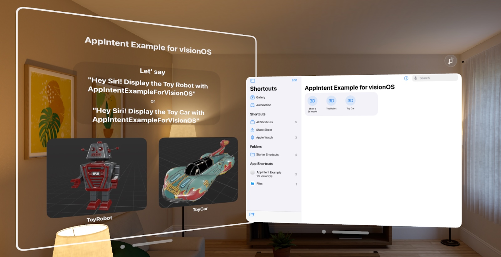
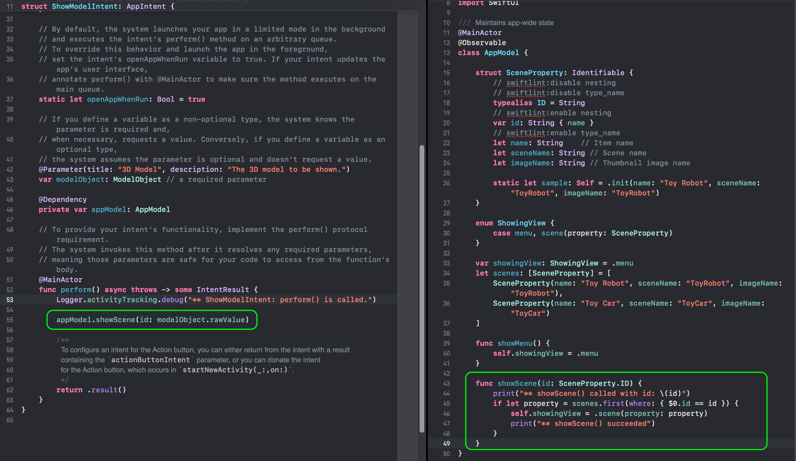
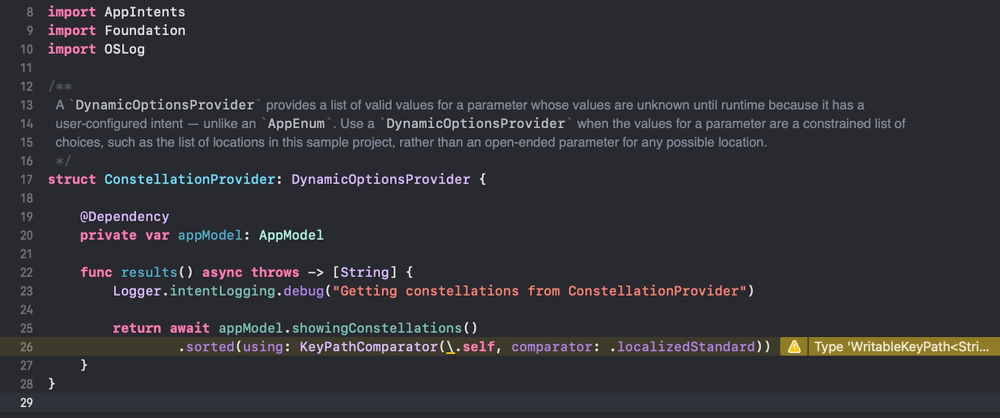

# AppIntent Example for visionOS

A sample project that shows an example of use of AppIntent in visionOS.

- Build: Xcode 16.1 beta 2+, macOS 15.1 beta 2+
- Target: visionOS 2.1+ (Device or Simulator)
- GitHub: https://github.com/ynagatomo/AppIntentExampleForVisionOS

You can display 3D models such as toy robots and toy cars using your voice through Siri.
Siri works with custom App Intents defined by your app to expose the functionality your app provides to users.


This sample app exposes the function to select and display 3D Models using App Intents.

You can select a 3D model or instruct Siri to present options by saying the following to Siri:

- 'Show the Toy Robot with AppIntentExampleForVisionOS."
- 'Show models with AppIntentExampleForVisionOS.'
- 'Display a Toy Car with AppIntentExampleForVisionOS."
- 'Display 3d models with AppIntentExampleForVisionOS.'





App Intents published by apps can also be executed from the Shortcut app. This is also useful for debugging etc.



## Explanation

There are roughly two types of App Intents.

1. Something that does not involve a UI and executes some kind of processing such as calculation or DB query and returns the result.
    - No matter when the App Intent process is executed, it should not change the state of the App.
1. Something that uses a UI to display some data or processing results.
    - Generally, by changing the App State, it will evoke changes in the App UI and display the results.
    - This can occur while the app is running, so developers must design their apps to handle such app state changes at any time.

This sample project shows an example of App Intent with a UI.
App Intents executed by Siri or the Shortcut app change the App State and, as a result, the View for Toy Robot or Toy Car will be shown.

In this sample, it simply switches the displayed View. Please try modifying it to include a more complex 3D display.



## Consideration

This sample project uses fixed keywords/options, 'Toy car' and 'Toy robot', to present a simple example.
By implementing ```DynamicOptionProvider```, it is also possible to handle dynamic keywords/options.



<!--
<blockquote>
...</blockquote>
-->

## References

- Apple Documentation: [App Intents](https://developer.apple.com/documentation/appintents)


## License

MIT license 
